# File Organizer Feature Reference Document

## Overview

A visual file organization system for managing uploaded files in Firebase Storage, designed to help users categorize and process documents that require different types of handling.

## Core Concept

A multi-column interface that allows users to visually organize uploaded files into different processing categories through an automated analysis and processing workflow.

## Processing Flow Diagram

```mermaid
stateDiagram-v2
    [*] --> RawUploaded : File Upload
    
    state RawUploaded {
        [*] --> AnalyzeFile : Auto-analyze
        AnalyzeFile --> Bundle : Multi-doc detected
        AnalyzeFile --> CompleteSingle : Single complete doc
        AnalyzeFile --> PartialDoc : Incomplete doc detected
    }
    
    Bundle --> SplitProcess : Split bundle
    
    state SplitProcess {
        [*] --> Splitting : Processing...
        Splitting --> IndividualFiles : Generate individual docs
    }
    
    CompleteSingle --> CompleteDocuments : Direct move
    PartialDoc --> PartialFiles : Direct move
    
    IndividualFiles --> AnalyzeIndividual : Analyze completeness
    
    state AnalyzeIndividual {
        [*] --> CheckCompleteness
        CheckCompleteness --> IsComplete : Complete doc
        CheckCompleteness --> IsPartial : Incomplete doc
    }
    
    IsComplete --> CompleteDocuments : Move to final
    IsPartial --> PartialFiles : Move to partials
    
    state PartialFiles {
        [*] --> WaitingForMatch : Looking for other parts
        WaitingForMatch --> FoundMatch : Match found
        FoundMatch --> MergeProcess : Merge partials
        
        state MergeProcess {
            [*] --> Merging : Combining files...
            Merging --> MergedComplete : Complete document created
        }
        
        MergedComplete --> CompleteDocuments : Move to final
    }
    
    CompleteDocuments --> [*] : Processing complete
    
    note right of RawUploaded : Column 1:\nRaw Uploaded Files
    note right of IndividualFiles : Column 2:\nSplit Files
    note right of PartialFiles : Column 3:\nFile Fragments
    note right of CompleteDocuments : Column 4:\nComplete Documents
```

## Kanban Board Workflow

```mermaid
flowchart TB
    subgraph Col1 ["📁 Column 1: Raw Uploaded Files"]
        Bundle["📄📄📄📄📄<br/>Bundle<br/>(5 docs)"]
        Single["📄<br/>Complete<br/>Single"]
        Partial["📄⚠️<br/>Partial<br/>Document"]
    end
    
    subgraph Col2 ["📂 Column 2: Split Files"]
        DocA["📄<br/>Doc A<br/>(from bundle)"]
        DocB["📄<br/>Doc B<br/>(from bundle)"]
        DocC["📄<br/>Doc C<br/>(from bundle)"]
        DocD["📄<br/>Doc D<br/>(from bundle)"]
        DocE["📄<br/>Doc E<br/>(from bundle)"]
    end
    
    subgraph Col3 ["⚠️ Column 3: File Fragments"]
        PartialRaw["📄⚠️<br/>Partial<br/>from Raw"]
        PartialSplit["📄⚠️<br/>Partial<br/>from Split"]
        Merging["🔄<br/>Merging<br/>Process"]
    end
    
    subgraph Col4 ["✅ Column 4: Complete Documents"]
        CompleteRaw["📄✅<br/>Complete<br/>from Raw"]
        CompleteSplit["📄✅<br/>Complete<br/>from Split"]
        CompleteMerge["📄✅<br/>Complete<br/>from Merge"]
    end
    
    %% Flow from Column 1
    Bundle -.->|Split| DocA
    Bundle -.->|Split| DocB
    Bundle -.->|Split| DocC
    Bundle -.->|Split| DocD
    Bundle -.->|Split| DocE
    
    Single -->|Direct Move| CompleteRaw
    Partial -->|Direct Move| PartialRaw
    
    %% Flow from Column 2
    DocA -->|If Complete| CompleteSplit
    DocB -->|If Complete| CompleteSplit
    DocC -->|If Partial| PartialSplit
    DocD -->|If Complete| CompleteSplit
    DocE -->|If Partial| PartialSplit
    
    %% Flow within Column 3
    PartialRaw -->|Find Match| Merging
    PartialSplit -->|Find Match| Merging
    
    %% Flow from Column 3 to Column 4
    Merging -->|Merge Complete| CompleteMerge
    
    %% Styling
    classDef bundleCard fill:#ffeb3b,stroke:#f57f17,stroke-width:3px
    classDef completeCard fill:#4caf50,stroke:#2e7d32,stroke-width:2px
    classDef partialCard fill:#ff9800,stroke:#ef6c00,stroke-width:2px
    classDef processCard fill:#2196f3,stroke:#1565c0,stroke-width:2px
    
    class Bundle bundleCard
    class Single,CompleteRaw,CompleteSplit,CompleteMerge completeCard
    class Partial,PartialRaw,PartialSplit partialCard
    class DocA,DocB,DocC,DocD,DocE,Merging processCard
```



## Layout Design

### Column 1: Raw Uploaded Files (Far Left)
- **Purpose**: Display all recently uploaded files in their original, unprocessed state
- **Visual Design**: Small cards representing file icons
- **Content**: Each card shows:
  - File thumbnail/icon
  - Filename
  - Upload date/time
  - File type indicator
- **Functionality**: Source column for dragging files to processing categories

### Column 2: Split Files (Center-Left)
- **Purpose**: Individual documents that have been extracted from bundle files
- **Content**: Each card shows documents that were split from multi-document bundles
- **Processing Action**: Analysis to determine if each split document is complete or partial
- **Next Steps**: Route to either File Fragments (Column 3) or Complete Documents (Column 4)

### Column 3: File Fragments (Center-Right)
- **Purpose**: Incomplete documents that are missing pages or components
- **Content**: Partial files from raw uploads and incomplete documents from split bundles
- **Processing Action**: Find matching fragments and merge them into complete documents
- **Next Steps**: Once matching fragments are found and merged, move complete documents to Column 4

### Column 4: Complete Documents (Far Right)  
- **Purpose**: Finalized, complete documents ready for use
- **Content**: Documents that are verified as complete from any processing stage
- **Sources**: Complete singles from raw uploads, complete documents from split bundles, merged documents from fragments

## User Workflow

1. **Upload Phase**: Files appear in Column 1 (Raw Uploaded Files)
2. **Organization Phase**: User drags files from Column 1 to appropriate buckets in Column 2
3. **Processing Phase**: System processes files based on their categorization
4. **Completion**: Processed files move to final organized state

## Technical Considerations

### File Types
- Primary focus: PDF documents
- Extensible to other document types (images, Office documents, etc.)

### Processing Operations
- **Document Bundles**: PDF splitting functionality
- **Partial Files**: PDF merging/combining functionality

### Integration Points
- Firebase Storage for file storage
- Existing upload system in Bookkeeper application
- Potential integration with PDF processing libraries

## User Experience Goals

- **Visual Organization**: Clear, intuitive drag-and-drop interface
- **File Identification**: Easy recognition of file types and processing needs
- **Workflow Efficiency**: Streamlined process from upload to organized storage
- **Processing Transparency**: Clear indication of what actions will be taken

## Future Considerations

- Additional processing categories as needs arise
- Batch processing capabilities
- Automated categorization suggestions
- Integration with existing file management features

## Success Metrics

- Reduced time spent manually organizing uploaded documents
- Improved accuracy in document separation and combination
- User satisfaction with visual organization workflow
- Successful processing of bundled and partial documents