# Document Processing Workflow

## Overview

A visual file organization system for managing uploaded files in Firebase Storage, designed to help users categorize and process documents that require different types of handling.

## Core Concept

A multi-column interface that allows users to visually organize uploaded files into different processing categories through an automated analysis and processing workflow.

## Kanban Board Workflow

```mermaid
flowchart TB
    subgraph Col0 ["📁 Storage 1: Uploads"]
        OnePageUpload["📸photograph.jpg"]
        SingleUpload["📧email in .msg format"]
        BundleUpload["📚3 Bundled Documents"]
        IncompleteUpload["📑⚠️Incomplete Document PDF"]
    end

    subgraph Col1 ["📁 Storage 2: PDF"]
        OnePage["📄single page PDF"]
        Single["📖Complete Document"]
        Incomplete["📑⚠️Incomplete Document PDF"]
        Bundle["📚3 Bundled Documents"]

    end

    subgraph Col2 ["📂 Storage 3: Split Files"]
        DocA["📖Complete Document"]
        DocC["📑Incomplete PDF"]

    end

    subgraph Col3 ["📄 Storage 4: Pages"]
        SoloPage1["🧩Page 1 of 3"]
        PageRaw2["🧩Page 2 of 3"]
        SoloPage2["🧩Page 2 of 3"]
        PageRaw3["🧩Page 3 of 3"]
        PageRaw1["🧩Page 4 of 7"]
        OnePage_split["🧩Page 4 of 7"]
    end

    subgraph Col4 ["🗄️ Database 2: Merge Pages"]
        MergedDoc{"Find & Associate<br/>👉 page 1 of 3<br/>👉 page 2 of 3<br/>👉 page 3 of 3"}
        FindsPages{"Find & Associate<br/>👉Page 4 of 7"}
    end

    subgraph Col5 ["📁 Storage 5: Processed"]

        OnePageComplete["📄single page PDF"]
        CompleteRaw["📖PDF Document #1"]
        CompleteSplit["📖PDF Document #2"]
        CompleteMerged["📖PDF Document #3"]
        IncompleteFinal["📑⚠️PDF document with missing pages"]

    end

    subgraph DB1 ["🗄️ Database 1: Best Copy"]
        ChooseBestCopy3{"Choose Best:<br/>👉Page 1 of 3"}
        ChooseBestCopy2{"Choose Best:<br/>👉Page 2 of 3<br/>👉Page 2 of 3"}
        ChooseBestCopy4{"Choose Best:<br/>👉Page 3 of 3"}
        ChooseBestCopy{"Choose Best:<br/>👉Page 4 of 7<br/>👉Page 4 of 7"}
    end

    %% Flow from Storage 1 to Storage 2 (OCR Processing)
    OnePageUpload -->|print to PDF| OnePage
    SingleUpload -->|print to PDF| Single
    BundleUpload -->|PDF| Bundle
    IncompleteUpload -->|PDF| Incomplete

    %% Flow from Storage 2

    Single -->|Direct Move| CompleteRaw
    OnePage -->|Direct Move| OnePageComplete


    Bundle -.->|Split| DocA
    Bundle -.->|Split to Pages| OnePage_split
    Bundle -.->|Split| DocC

    %% Flow from Column 2

    DocA -->|Complete| CompleteSplit

    DocC -.->|Split to Pages| SoloPage1
    DocC -.->|Split to Pages| SoloPage2




    %% Flow from Column 1 direct to Column 3
    Incomplete -.->|Split to Pages| PageRaw1
    Incomplete -.->|Split to Pages| PageRaw2
    Incomplete -.->|Split to Pages| PageRaw3

    %% Flow from Column 3 to Column 4 - References
    OnePage_split -->|Reference| ChooseBestCopy
    PageRaw1 -->|Reference| ChooseBestCopy

    SoloPage2 -->|Reference| ChooseBestCopy2
    PageRaw2 -->|Reference| ChooseBestCopy2

    %% Flow from Column 3 to Database 1 - Pages to decision nodes
    SoloPage1 -->|Reference| ChooseBestCopy3
    PageRaw3 -->|Reference| ChooseBestCopy4

    %% Flow from Database 1 to Database 2 - Decision nodes to merged document
    ChooseBestCopy2 -->|Get Best| MergedDoc
    ChooseBestCopy3 -->|Get Best| MergedDoc
    ChooseBestCopy4 -->|Get Best| MergedDoc
    ChooseBestCopy -->|GetBest| FindsPages

    %% Flow from Database 2 to Storage 5
    MergedDoc -->|Assemble| CompleteMerged
    FindsPages -->|Assemble| IncompleteFinal


    %% Color Coding by Document Source/Family
    classDef singleDocFamily fill:#ffebee,stroke:#e53935,stroke-width:2px,color:#000000
    classDef bundleDocFamily fill:#fff9c4,stroke:#f57f17,stroke-width:2px,color:#000000
    classDef incompleteDocFamily fill:#e3f2fd,stroke:#1976d2,stroke-width:2px,color:#000000
    classDef onePageDocFamily fill:#f3e5f5,stroke:#9c27b0,stroke-width:2px,color:#000000
    classDef blendedDocFamily fill:#e8f5e8,stroke:#4caf50,stroke-width:2px,color:#000000
    classDef duplicateNode fill:#fff3e0,stroke:#ff9800,stroke-width:2px,color:#000000

    %% Single Complete Document Family (Light Red)
    class Single,CompleteRaw singleDocFamily

    %% Bundle Document Family (Light Yellow)
    class Bundle,DocA,OnePage_split,DocC,SoloPage1,SoloPage2,CompleteSplit bundleDocFamily

    %% Incomplete Document Family (Light Blue)
    class Incomplete,PageRaw1,PageRaw2,PageRaw3,IncompleteFinal incompleteDocFamily

    %% One Page Document Family (Light Purple)
    class OnePage,OnePageComplete onePageDocFamily

    %% Blended Document Family (Green - Yellow+Blue blend for multi-source documents)
    class CompleteMerged blendedDocFamily

    %% Storage 1 Upload nodes inherit same colors as their Storage 2 counterparts
    class OnePageUpload onePageDocFamily
    class SingleUpload singleDocFamily
    class BundleUpload bundleDocFamily
    class IncompleteUpload incompleteDocFamily

```

