# Simplified Deduplication Using Built-in Database Constraints

This diagram illustrates a streamlined file deduplication system that leverages built-in database constraints and data structures to eliminate custom deduplication logic while maintaining high performance and reliability.

## Overview

Instead of complex multi-tier caching and progressive hashing, this approach uses native database features and browser APIs to automatically handle duplicates. The system relies on unique constraints, document IDs, and Set/Map data structures for zero-maintenance deduplication.

## Simplified Process Flow Diagram

```mermaid
%%{ init: { 'theme': 'base', 'themeVariables': { 'primaryColor': '#000000', 'primaryTextColor': '#ffffff', 'nodeBorder': '#000000', 'tertiaryColor': '#ffff00', 'clusterBkg': '#f0f8ff', 'clusterBorder': '#4682b4' } } }%%
flowchart TD
    A[Files Selected for Upload] --> B[Step 1: Generate File Hashes]
    
    B --> C[Parallel Hash Generation<br/>Web Crypto API SHA-256]
    C --> D[Step 2: Client-Side Deduplication]
    
    D --> E[JavaScript Set/Map<br/>Automatic Duplicate Removal]
    E --> TagA[🏷️ Tag Queue Duplicates<br/>status: duplicate]
    
    TagA --> F[Step 3: Batch Database Query]
    F --> G[Batch Query All Hashes<br/>db.getAll hash array]
    G --> H[Categorize Files by Status]
    H --> TagB[🏷️ Tag Files<br/>status: ready, existing]
    
    TagB --> CountA[📊 Count File Status<br/>Ready, Existing, Duplicates]
    CountA --> I[Display Upload Summary<br/>Ready: X, Existing: Y, Duplicates: Z]
    I --> DisplayA[🖥️ Show File List<br/>User Review Interface]
    
    DisplayA --> J{User Clicks Start Upload?}
    J -->|No| K[Wait for User Action]
    J -->|Yes| L[Process Ready Files Only]
    
    K --> J
    L --> TagC[🏷️ Tag Uploading<br/>status: uploading]
    TagC --> M[Batch Upload File Data<br/>Promise.all uploads]
    M --> TagD[🏷️ Tag Upload Results<br/>status: successful, failed]
    
    TagD --> N[Update File Registry<br/>Atomic Batch Operations]
    N --> CountB[📊 Count Final Results<br/>Successful, Failed, Skipped]
    CountB --> O[Display Final Results<br/>Uploaded: X, Skipped: Y, Failed: Z]
    O --> DisplayB[🖥️ Show Results Summary<br/>Completion Interface]
    DisplayB --> P[Process Complete]
    
    classDef startNode fill:#008000,color:#ffffff
    classDef decisionNode fill:#000000,color:#ffff00
    classDef endNode fill:#dc143c,color:#ffffff
    classDef standardNode fill:#ffffff,color:#000000
    classDef tagInterface fill:#ffecb3,color:#000000
    classDef countInterface fill:#e8f5e8,color:#000000
    classDef displayInterface fill:#e1f5fe,color:#000000
    
    class A startNode
    class J decisionNode
    class P endNode
    class B,C,D,E,F,G,H,I,K,L,M,N,O standardNode
    class TagA,TagB,TagC,TagD tagInterface
    class CountA,CountB countInterface
    class DisplayA,DisplayB displayInterface
```



## Key Advantages of Constraint-Based Approach

### 1. Zero Custom Deduplication Logic
- **Built-in Set/Map**: Automatic duplicate removal in JavaScript
- **Firestore Document IDs**: Hash as ID prevents duplicates at database level
- **Web Crypto API**: Consistent, fast hash generation
- **Atomic Operations**: Database handles concurrency automatically

### 2. Simplified Architecture
```javascript
// Entire deduplication logic in ~20 lines
const uploadFiles = async (files) => {
  // Step 1: Generate hashes
  const hashedFiles = await Promise.all(
    files.map(async file => ({
      file,
      hash: await generateHash(file),
      metadata: extractMetadata(file)
    }))
  );
  
  // Step 2: Client-side deduplication
  const uniqueFiles = new Map();
  hashedFiles.forEach(item => {
    uniqueFiles.set(item.hash, item); // Automatic duplicate removal
  });
  
  // Step 3: Database constraint handling
  const results = await Promise.all(
    Array.from(uniqueFiles.values()).map(async ({ hash, file, metadata }) => {
      try {
        await db.collection('files').doc(hash).set({
          ...metadata,
          hash,
          teamId: currentTeam,
          uploadedAt: new Date(),
          uploadedBy: currentUser.uid
        });
        return { hash, status: 'uploaded', file };
      } catch (error) {
        if (error.code === 'already-exists') {
          return { hash, status: 'duplicate', file };
        }
        throw error;
      }
    })
  );
  
  return results;
};
```

### 3. Performance Benefits
- **No Complex Caching**: Database IS the cache
- **No Progressive Hashing**: Single SHA-256 pass with Web Workers
- **No Cache Invalidation**: Database handles consistency
- **Minimal Memory Usage**: Leverage browser/database native optimizations

## Database Schema Design

### Firestore Collections
```javascript
// Primary file storage - hash as document ID
/files/{hash}
{
  hash: string,           // Document ID (automatic uniqueness)
  fileName: string,
  fileSize: number,
  mimeType: string,
  teamId: string,         // Team isolation
  uploadedBy: string,     // User ID
  uploadedAt: Timestamp,
  downloadURL: string,
  metadata: {
    lastModified: Timestamp,
    path: string,
    tags: string[]
  }
}

// Team file index - for fast queries
/teams/{teamId}/fileIndex/{hash}
{
  fileName: string,
  fileSize: number,
  uploadedAt: Timestamp,
  uploadedBy: string
}

// File versions - when user chooses to keep duplicates
/files/{hash}/versions/{versionId}
{
  originalHash: string,
  versionId: string,
  fileName: string,
  uploadedAt: Timestamp,
  uploadedBy: string,
  reason: 'user_choice' | 'metadata_diff'
}
```

### Firestore Security Rules
```javascript
rules_version = '2';
service cloud.firestore {
  match /databases/{database}/documents {
    // Files accessible only by team members
    match /files/{hash} {
      allow read, write: if request.auth != null 
        && resource.data.teamId == request.auth.token.teamId;
    }
    
    // Team file index
    match /teams/{teamId}/fileIndex/{hash} {
      allow read, write: if request.auth != null 
        && teamId == request.auth.token.teamId;
    }
  }
}
```

## Implementation Steps

### Step 1: Hash Generation with Web Workers
```javascript
// worker.js - Dedicated hash calculation
self.onmessage = async function(e) {
  const { file, id } = e.data;
  const buffer = await file.arrayBuffer();
  const hashBuffer = await crypto.subtle.digest('SHA-256', buffer);
  const hashArray = Array.from(new Uint8Array(hashBuffer));
  const hash = hashArray.map(b => b.toString(16).padStart(2, '0')).join('');
  
  self.postMessage({ id, hash });
};

// main.js - Parallel hash generation
const generateHashes = async (files) => {
  const workers = Array(navigator.hardwareConcurrency || 4).fill().map(() => 
    new Worker('./worker.js')
  );
  
  const promises = files.map((file, index) => 
    new Promise(resolve => {
      const worker = workers[index % workers.length];
      worker.postMessage({ file, id: index });
      worker.onmessage = e => resolve({ ...e.data, file });
    })
  );
  
  const results = await Promise.all(promises);
  workers.forEach(worker => worker.terminate());
  return results;
};
```

### Step 2: Atomic Batch Operations
```javascript
const uploadFileBatch = async (uniqueFiles) => {
  const batch = db.batch();
  const results = [];
  
  for (const { hash, file, metadata } of uniqueFiles) {
    const fileRef = db.collection('files').doc(hash);
    const indexRef = db.collection('teams').doc(currentTeam)
      .collection('fileIndex').doc(hash);
    
    // Check if document exists first
    const doc = await fileRef.get();
    if (doc.exists) {
      results.push({ hash, status: 'duplicate', existing: doc.data() });
      continue;
    }
    
    // Add to batch
    batch.set(fileRef, { ...metadata, hash, teamId: currentTeam });
    batch.set(indexRef, {
      fileName: file.name,
      fileSize: file.size,
      uploadedAt: new Date()
    });
    
    results.push({ hash, status: 'uploaded' });
  }
  
  // Atomic commit
  await batch.commit();
  return results;
};
```

### Step 3: Duplicate Resolution UI
```javascript
const handleDuplicates = async (results) => {
  const duplicates = results.filter(r => r.status === 'duplicate');
  if (duplicates.length === 0) return results;
  
  // Simple user choice interface
  const choice = await showDuplicateDialog({
    count: duplicates.length,
    options: ['Skip Duplicates', 'Keep Both', 'Replace Existing']
  });
  
  switch (choice) {
    case 'skip':
      return results; // Keep original results
      
    case 'keep_both':
      return await createVersionedFiles(duplicates);
      
    case 'replace':
      return await replaceExistingFiles(duplicates);
  }
};
```

## Error Handling and Edge Cases

### Concurrent Upload Protection
```javascript
// Use Firestore transactions for race conditions
const safeUpload = async (hash, fileData) => {
  return await db.runTransaction(async (transaction) => {
    const fileRef = db.collection('files').doc(hash);
    const doc = await transaction.get(fileRef);
    
    if (doc.exists) {
      return { status: 'duplicate', existing: doc.data() };
    }
    
    transaction.set(fileRef, fileData);
    return { status: 'uploaded', hash };
  });
};
```

### Network Failure Recovery
```javascript
// Built-in Firestore offline support
db.enableNetwork(); // Automatic retry when back online

// Simple retry wrapper
const uploadWithRetry = async (files, maxRetries = 3) => {
  for (let attempt = 1; attempt <= maxRetries; attempt++) {
    try {
      return await uploadFiles(files);
    } catch (error) {
      if (attempt === maxRetries) throw error;
      await new Promise(resolve => setTimeout(resolve, 1000 * attempt));
    }
  }
};
```

## Performance Characteristics

### Time Complexity
- **Hash Generation**: O(n) where n = total file size
- **Client Deduplication**: O(k) where k = number of files
- **Database Operations**: O(k) with automatic indexing
- **Total**: Linear with file count and size (optimal)

### Space Complexity
- **Memory Usage**: O(k) for file list + hashes
- **Storage**: No redundant cache layers
- **Network**: Minimal - only unique files transferred

### Scalability
- **Concurrent Users**: Database handles automatically
- **Large Files**: Web Workers prevent UI blocking
- **Team Growth**: Firestore scales transparently
- **Storage Costs**: Pay only for unique files stored

## Migration from Existing System

### Phase 1: Parallel Implementation
- Run new system alongside existing
- Compare results for accuracy verification
- Gradual rollout to subset of users

### Phase 2: Data Migration
```javascript
// Migrate existing files to hash-based IDs
const migrateExistingFiles = async () => {
  const existingFiles = await db.collection('uploads').get();
  const batch = db.batch();
  
  for (const doc of existingFiles.docs) {
    const data = doc.data();
    const hash = await generateHashFromURL(data.downloadURL);
    
    // Create new document with hash ID
    const newRef = db.collection('files').doc(hash);
    batch.set(newRef, { ...data, hash, migratedFrom: doc.id });
  }
  
  await batch.commit();
};
```

### Phase 3: Cleanup
- Remove complex caching logic
- Simplify UI components
- Archive old collections after verification

## Benefits Summary

1. **Reduced Complexity**: ~90% less deduplication code
2. **Better Reliability**: Database constraints prevent inconsistencies
3. **Improved Performance**: No cache warming or complex lookups needed
4. **Lower Maintenance**: Built-in features handle edge cases
5. **Cost Effective**: No redundant storage, optimal Firestore usage
6. **Developer Experience**: Easier to understand and debug

This constraint-based approach transforms complex deduplication logic into simple, reliable database operations while maintaining all the benefits of the original system with significantly reduced implementation complexity.