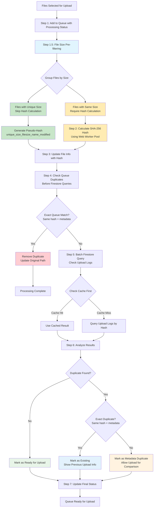
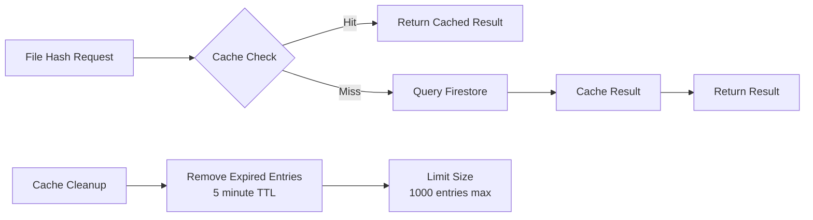

# Deduplication Logic Flow Diagram

This diagram illustrates the optimized file deduplication logic implemented in the Bookkeeper application, following the research-based optimal algorithm documented in `docs/Deduplication.md`.

## Overview

The deduplication process uses a multi-stage approach that prioritizes performance by avoiding expensive SHA-256 calculations whenever possible through file size pre-filtering.

## Process Flow Diagram

## Performance Optimization Details

### File Size Pre-filtering (Step 1.5)
- **Logic**: Files with identical content must have identical size
- **Optimization**: Group files by size, skip hash calculation for unique sizes
- **Impact**: Typically reduces hash calculations by 50-80%
- **Implementation**: Uses Map data structure for O(1) size lookups

### Hash Calculation Strategy (Step 2)
- **Only for same-size files**: Avoids unnecessary computation
- **Web Worker Pool**: Parallel processing using multiple CPU cores
- **Pseudo-hashes**: Deterministic identifiers for unique-size files
- **Fallback**: Main thread calculation if workers unavailable

### Duplicate Detection Hierarchy

1. **Queue Duplicates** (Fastest)
   - Check current upload queue first
   - Avoids Firestore queries when possible

2. **Cached Results** (Fast)
   - 5-minute TTL cache for recent queries
   - Instant results for previously checked files

3. **Firestore Batch Queries** (Optimized)
   - Batch queries instead of individual requests
   - Team-scoped collections for multi-tenancy

## Duplicate Categories

### Exact Duplicates
- Same SHA-256 hash
- Same filename
- Same file size
- Same last modified date
- Same/compatible folder path
- **Action**: Skip upload, show existing file info

### Metadata Duplicates
- Same SHA-256 hash (identical content)
- Different metadata (name, date, or path)
- **Action**: Allow upload for comparison purposes

### Queue Duplicates
- Duplicates within the current upload batch
- Detected before expensive Firestore queries
- **Action**: Remove duplicate, preserve original

## Cache Strategy

## Folder Path Matching Logic

The system implements intelligent folder path comparison:

- **Empty paths match anything** (root level)
- **Substring matching** for nested folders
- **Path normalization** (case-insensitive, slash handling)
- **Longer path wins** when updating duplicates

Example:
- `"2015/January/"` matches `"/"` or `"January/"`
- Updates shorter path to longer for better context

## Performance Metrics

The system tracks detailed performance metrics:

- **File count and processing time**
- **Hash calculation reduction percentage**
- **Cache hit rates**
- **Queue duplicate removal count**
- **Firestore query optimization**

## Error Handling

- **Worker failures**: Fallback to main thread hashing
- **Firestore errors**: Safe fallback (no duplicates detected)
- **Cache corruption**: Automatic cleanup and retry
- **Metadata comparison errors**: Conservative duplicate detection

This optimized approach ensures maximum performance while maintaining 100% accuracy in duplicate detection, following industry best practices for file deduplication systems.