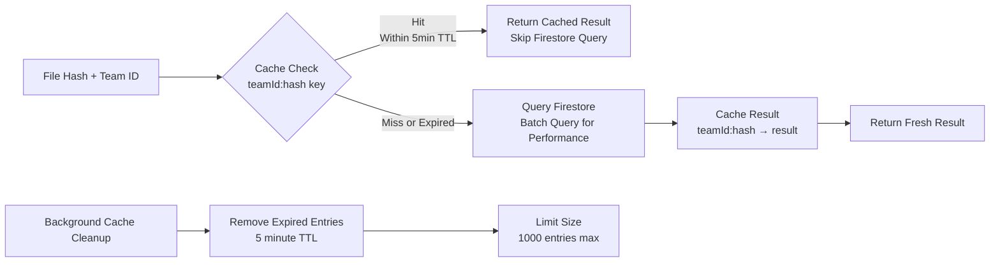

# Deduplication Logic Flow Diagram

This diagram illustrates the optimized file deduplication logic implemented in the Bookkeeper application, following the research-based optimal algorithm documented in `docs/Deduplication.md`.

## Overview

The deduplication process uses a multi-stage approach that prioritizes performance by avoiding expensive SHA-256 calculations whenever possible through file size pre-filtering.

## Process Flow Diagram

```mermaid
flowchart TD
    A[Files Selected for Upload] --> B[Step 1: Add to Queue with Processing Status]
    
    B --> C[Step 1.5: File Size Pre-filtering<br/>Compare ONLY within current batch]
    C --> D{Group Files by Size<br/>Within Current Upload Queue}
    
    D --> E[Files with Unique Size<br/>Skip Hash Calculation<br/>Generate Pseudo-Hash]
    D --> F[Files with Same Size<br/>Need Hash for Deduplication<br/>Calculate SHA-256]
    
    E --> G[Pseudo-Hash Generated<br/>unique_size_filesize_name_modified]
    F --> H[SHA-256 Hash Calculated<br/>Using Web Worker Pool]
    
    G --> I[Step 3: Update File Info with Hash]
    H --> I
    
    I --> J[Step 4: Check Queue Duplicates<br/>Compare with Existing Queue Files]
    
    J --> K{Exact Queue Match?<br/>Same hash + metadata}
    K -->|Yes| L[Remove Duplicate<br/>Update Original with Longer Path]
    K -->|No| M[Step 5: Batch Firestore Query<br/>Check Against Upload History]
    
    L --> AA[Processing Complete for Duplicate]
    M --> O{Check Cache First<br/>teamId:hash lookup}
    
    O -->|Cache Hit<br/>5min TTL| P[Use Cached Result<br/>Skip Firestore Query]
    O -->|Cache Miss| Q[Query Upload Logs by Hash<br/>Batch Query for Performance]
    
    P --> R[Step 6: Analyze Firestore Results]
    Q --> QQ[Store Result in Cache<br/>teamId:hash → result]
    QQ --> R
    
    R --> S{Previous Upload Found?}
    S -->|No| T[Mark as Ready for Upload<br/>status = 'ready']
    S -->|Yes| U{Exact Previous Duplicate?<br/>Same hash + all metadata}
    
    U -->|Yes| V[Mark as Existing<br/>status = 'existing'<br/>Show Upload Date & User]
    U -->|No| W[Mark as Metadata Duplicate<br/>status = 'ready'<br/>Show Warning + Allow Upload]
    
    T --> X[Step 7: Check for Queue Metadata Duplicates]
    V --> X
    W --> X
    
    X --> Y{Same Hash Different Metadata<br/>in Current Queue?}
    Y -->|Yes| Z[Mark as Queue Duplicate<br/>status = 'duplicate'<br/>Position After Original]
    Y -->|No| BB[Keep Current Status]
    
    Z --> CC[Final Status Update<br/>processing → final status]
    BB --> CC
    
    CC --> DD[Queue Ready for Upload]
    
    style C fill:#e1f5fe
    style E fill:#c8e6c9
    style F fill:#ffecb3
    style G fill:#c8e6c9
    style H fill:#ffecb3
    style L fill:#ffcdd2
    style P fill:#e8f5e8
    style QQ fill:#fff9c4
    style V fill:#e3f2fd
    style W fill:#fff3e0
    style T fill:#e8f5e8
    style Z fill:#fce4ec
```

## Performance Optimization Details

### File Size Pre-filtering (Step 1.5)
- **Scope**: Only compares files within the current upload batch/queue
- **Logic**: Files with identical content must have identical size
- **Optimization**: Group files by size, skip hash calculation for unique sizes within batch
- **Impact**: Typically reduces hash calculations by 50-80% within current upload session
- **Implementation**: Uses Map data structure for O(1) size lookups
- **Limitation**: Does not compare against previously uploaded files at this stage

### Hash Calculation Strategy (Step 2)
- **Only for same-size files**: Avoids unnecessary computation
- **Web Worker Pool**: Parallel processing using multiple CPU cores
- **Pseudo-hashes**: Deterministic identifiers for unique-size files
- **Fallback**: Main thread calculation if workers unavailable

### Duplicate Detection Hierarchy

1. **Exact Queue Duplicates** (Fastest - Step 4)
   - Check against existing files in upload queue
   - Removes exact duplicates, updates original with longer path
   - Avoids all Firestore queries when possible

2. **Cached Firestore Results** (Fast - Step 5)
   - 5-minute TTL cache with teamId:hash keys
   - 1000 entry limit with automatic cleanup
   - Instant results for recently checked files

3. **Fresh Firestore Batch Queries** (Optimized - Step 5)
   - Batch queries instead of individual requests
   - Results cached for future use
   - Team-scoped collections for multi-tenancy

4. **Queue Metadata Duplicates** (Final Check - Step 7)
   - Same hash but different metadata within current queue
   - Positioned after original file for comparison

## Duplicate Categories

### Exact Duplicates
- Same SHA-256 hash
- Same filename
- Same file size
- Same last modified date
- Same/compatible folder path
- **Action**: Skip upload, show existing file info

### Metadata Duplicates
- Same SHA-256 hash (identical content)
- Different metadata (name, date, or path)
- **Action**: Allow upload for comparison purposes

### Queue Duplicates

#### Exact Queue Duplicates
- Identical hash + metadata within current upload batch
- Detected before expensive Firestore queries in Step 4
- **Action**: Remove duplicate, preserve original with longer path

#### Queue Metadata Duplicates  
- Same hash but different metadata within current upload batch
- Detected in Step 7 after Firestore checks
- **Action**: Mark as duplicate, position after original for comparison

## Cache Strategy

The caching system optimizes Firestore queries by storing duplicate detection results:

**Cache Key Format**: `${teamId}:${fileHash}` ensures team-scoped results
**Cache Value**: Complete duplicate detection result including upload metadata
**Performance Impact**: Eliminates repeated Firestore queries for same files within 5 minutes

## Folder Path Matching Logic

The system implements intelligent folder path comparison:

- **Empty paths match anything** (root level)
- **Substring matching** for nested folders
- **Path normalization** (case-insensitive, slash handling)
- **Longer path wins** when updating duplicates

Example:
- `"2015/January/"` matches `"/"` or `"January/"`
- Updates shorter path to longer for better context

## Performance Metrics

The system tracks detailed performance metrics:

- **File count and processing time**
- **Hash calculation reduction percentage**
- **Cache hit rates**
- **Queue duplicate removal count**
- **Firestore query optimization**

## Error Handling

- **Worker failures**: Fallback to main thread hashing
- **Firestore errors**: Safe fallback (no duplicates detected)
- **Cache corruption**: Automatic cleanup and retry
- **Metadata comparison errors**: Conservative duplicate detection

This optimized approach ensures maximum performance while maintaining 100% accuracy in duplicate detection, following industry best practices for file deduplication systems.