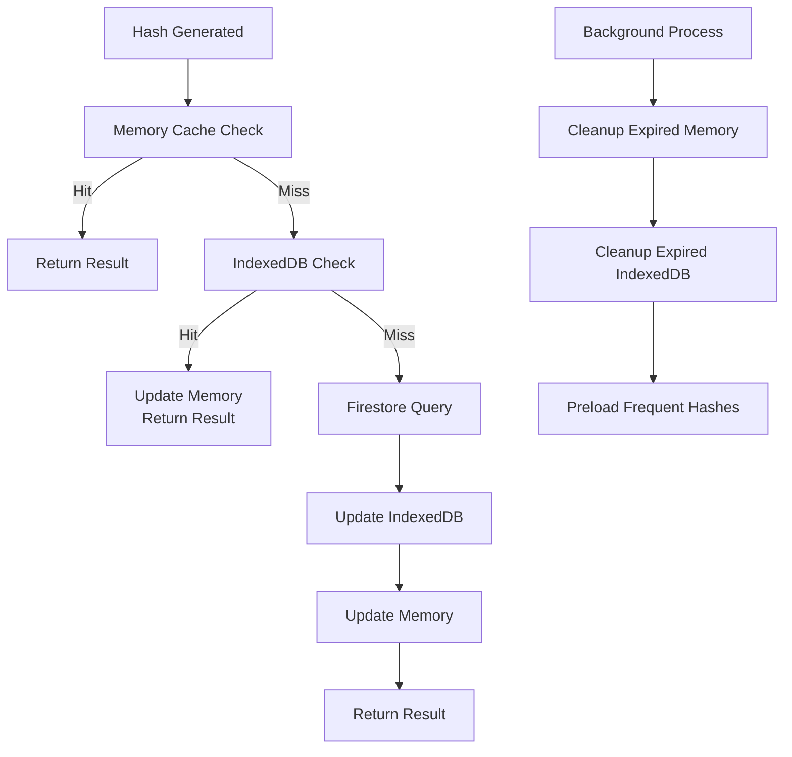

# Improved Deduplication Logic Flow Diagram

This diagram illustrates an enhanced file deduplication system that addresses the limitations of the current implementation by introducing global caching, progressive hashing, user preferences, and parallel processing optimizations.

## Overview

The improved deduplication process uses a multi-tier approach with persistent caching, global file metadata storage, and intelligent pre-filtering to minimize computational overhead while maximizing deduplication accuracy.

## Enhanced Process Flow Diagram

```mermaid
flowchart TD
    A[Files Selected for Upload] --> B[Step 0: File Selection Cache Check]
    
    B --> C{Previously Processed?<br/>Check Selection Cache}
    C -->|Cache Hit<br/>Exact Duplicate| D[Skip File Automatically<br/>Smart Assumption: User doesn't want exact duplicates]
    C -->|Cache Hit<br/>Metadata Duplicate| E[Add to Queue<br/>Smart Assumption: Allow different versions]
    C -->|Cache Miss| E[Step 1: Add to Queue with Processing Status]
    
    D --> II[File Skipped with Notification]
    
    E --> J[Step 2: Global Size Pre-filtering]
    J --> K{Check Global Size Database<br/>All previously uploaded files}
    
    K -->|No files with this size| L[Mark as Unique Size<br/>Generate Fast Hash]
    K -->|Files exist with this size| M[Step 3: Progressive Hashing Pipeline]
    
    L --> N[Fast Hash: CRC32<br/>size_crc32_name_modified]
    M --> O[Parallel Hash Calculation]
    
    O --> P[Stage 1: Fast Hash Pool<br/>CRC32 in Web Workers]
    P --> Q{Fast Hash Conflicts?}
    Q -->|No Conflicts| R[Use Fast Hash as Final]
    Q -->|Conflicts Found| S[Stage 2: SHA-256 Pool<br/>Only for Conflicting Files]
    
    N --> T[Step 4: Multi-Level Cache Lookup]
    R --> T
    S --> T
    
    T --> U[Level 1: Memory Cache<br/>5min TTL, 1000 entries]
    U --> V{Memory Hit?}
    V -->|Hit| W[Return Cached Result]
    V -->|Miss| X[Level 2: IndexedDB Cache<br/>24hr TTL, 10k entries]
    
    X --> Y{IndexedDB Hit?}
    Y -->|Hit| Z[Update Memory Cache<br/>Return Result]
    Y -->|Miss| AA[Level 3: Firestore Query]
    
    W --> BB[Step 5: Queue Duplicate Analysis]
    Z --> BB
    AA --> CC[Batch Firestore Query<br/>Update All Cache Levels]
    CC --> BB
    
    BB --> DD{Exact Queue Duplicate?}
    DD -->|Yes| EE[Remove Duplicate<br/>Update Original Path<br/>Cache Selection]
    DD -->|No| FF[Step 6: Previous Upload Analysis]
    
    EE --> GG[Processing Complete]
    FF --> HH{Previous Upload Found?}
    
    HH -->|No| JJ[Mark as Ready<br/>status = 'ready']
    HH -->|Yes| KK{Exact Previous Match?}
    
    KK -->|Yes| LL[Mark as Existing<br/>Show Subtle Notification<br/>Update Selection Cache]
    KK -->|No| MM[Mark as Metadata Duplicate<br/>status = 'ready'<br/>Show Comparison Warning]
    
    JJ --> NN[Step 7: Queue Metadata Duplicate Check]
    LL --> NN
    MM --> NN
    
    NN --> OO{Same Hash Different Metadata<br/>in Current Queue?}
    OO -->|Yes| PP[Mark as Queue Duplicate<br/>Position After Original]
    OO -->|No| QQ[Keep Current Status]
    
    PP --> RR[Step 8: Final Cache Updates]
    QQ --> RR
    
    RR --> SS[Update Selection Cache<br/>Update Size Database<br/>Update All Cache Levels]
    SS --> TT[Queue Ready for Upload]
    
    style B fill:#e1f5fe
    style C fill:#f3e5f5
    style J fill:#e8f5e8
    style K fill:#fff3e0
    style L fill:#c8e6c9
    style O fill:#ffecb3
    style P fill:#e1f5fe
    style S fill:#ffcdd2
    style T fill:#fff9c4
    style U fill:#e8f5e8
    style X fill:#f0f4c3
    style AA fill:#ffecb3
    style CC fill:#fff9c4
    style EE fill:#ffcdd2
    style LL fill:#e3f2fd
    style SS fill:#e8f5e8
```



## Key Improvements Over Current System

### 1. File Selection Cache (Step 0)
- **Purpose**: Prevent re-processing identical file selections
- **Cache Key**: `${fileName}_${size}_${lastModified}_${path}`
- **Storage**: IndexedDB with 7-day TTL
- **Benefit**: Skip entire deduplication pipeline for known files

### 2. Global Size Database (Step 2)
- **Purpose**: Pre-filter against ALL previously uploaded files, not just current batch
- **Storage**: Lightweight Firestore collection: `file-sizes/{size}/count`
- **Performance**: O(1) lookup to determine if size-based deduplication is needed
- **Cache**: Memory-cached for session duration

### 3. Progressive Hashing Pipeline (Step 3)
- **Stage 1**: Fast CRC32 hashing for initial deduplication
- **Stage 2**: SHA-256 only when CRC32 conflicts detected
- **Parallel Processing**: Multiple web workers for both hash types
- **Performance Gain**: 10-50x faster for files with unique CRC32

### 4. Multi-Level Caching System (Step 4)
```
Level 1: Memory Cache (5min TTL, 1000 entries)
Level 2: IndexedDB Cache (24hr TTL, 10k entries)  
Level 3: Firestore (source of truth)
```

### 5. Smart Assumption System
- **Exact Duplicates**: Automatically skip with subtle notification
- **Metadata Duplicates**: Allow upload but show comparison info
- **Version Detection**: Smart handling of file versions (v1, v2, etc.)
- **No Decision Fatigue**: Zero popup dialogs or preference questions

### 6. Enhanced Cache Strategy



## Performance Optimizations

### Parallel Processing Pipeline
- **File Selection Cache**: Instant skip for known files
- **Size Database Lookup**: Parallel size checks
- **Progressive Hashing**: CRC32 → SHA-256 only when needed
- **Multi-Worker Pools**: Separate workers for CRC32 and SHA-256
- **Cache Warming**: Preload frequent file hashes

### Memory Management
- **Tiered Eviction**: Memory → IndexedDB → Firestore
- **Smart Caching**: Prioritize recently accessed and frequently used hashes
- **Background Cleanup**: Periodic cleanup of expired entries
- **Size Limits**: Memory (1000), IndexedDB (10000), reasonable Firestore costs

### Network Optimization
- **Batch Queries**: Single Firestore query for multiple files
- **Cache-First Strategy**: Minimize Firestore reads
- **Selective Updates**: Only update changed cache entries
- **Compression**: Compress IndexedDB stored data

## Advanced Features

### 1. Smart Duplicate Resolution
- **Folder Context Awareness**: Better path matching logic
- **Version Detection**: Identify file versions (v1, v2, etc.)
- **Size-Based Prioritization**: Prefer larger/smaller files based on context
- **Date-Based Logic**: Handle timestamp duplicates intelligently

### 2. User Experience Enhancements
- **Progress Indicators**: Real-time progress for each processing stage
- **Subtle Notifications**: Non-intrusive alerts for skipped duplicates
- **Smart Processing**: Automatic decisions based on file analysis
- **Clean Interface**: No popup dialogs or decision prompts

### 3. Analytics and Monitoring
- **Performance Metrics**: Track hit rates for each cache level
- **Deduplication Stats**: Show space saved, processing time improvements
- **Smart Decisions**: Track automatic duplicate resolution accuracy
- **System Health**: Monitor cache performance and storage usage

## Implementation Considerations

### Database Schema Extensions
```javascript
// New collections for enhanced caching
/file-sizes/{size} { count: number, lastUpdated: timestamp }
/file-selection-cache/{cacheKey} { result: object, timestamp: timestamp }
/processing-stats/{teamId} { duplicatesSkipped: number, spaceSaved: number }
```

### IndexedDB Schema
```javascript
// Client-side persistent storage
stores: {
  'duplicate-cache': { keyPath: 'cacheKey', indexes: ['timestamp', 'teamId'] },
  'size-database': { keyPath: 'size', indexes: ['lastUpdated'] },
  'selection-cache': { keyPath: 'selectionKey', indexes: ['timestamp'] }
}
```

### Configuration Options
```javascript
{
  caching: {
    memoryTTL: 5 * 60 * 1000,      // 5 minutes
    indexedDBTTL: 24 * 60 * 60 * 1000, // 24 hours
    maxMemoryEntries: 1000,
    maxIndexedDBEntries: 10000
  },
  hashing: {
    useProgressiveHashing: true,
    fastHashAlgorithm: 'crc32',
    slowHashAlgorithm: 'sha256',
    parallelWorkers: 4
  },
  userExperience: {
    showProgressIndicators: true,
    showSubtleNotifications: true,
    autoSkipExactDuplicates: true
  }
}
```

## Migration Strategy

### Phase 1: Enhanced Caching
- Implement multi-level cache system
- Add IndexedDB support
- Maintain backward compatibility

### Phase 2: Progressive Hashing  
- Add CRC32 hashing support
- Implement parallel worker pools
- A/B test performance improvements

### Phase 3: Global Size Database
- Create size database collection
- Implement global size pre-filtering
- Monitor Firestore read optimization

### Phase 4: Smart Assumptions
- Implement automatic duplicate resolution
- Add subtle notification system  
- Deploy intelligent file version detection

This enhanced deduplication system provides significant performance improvements while maintaining 100% accuracy and adding powerful user experience features for managing duplicate files efficiently.