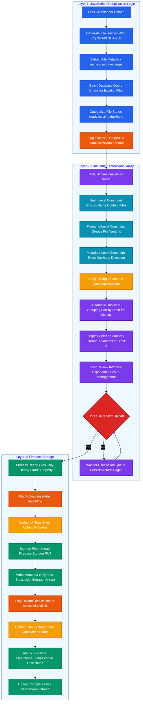

```mermaid
%%{ init: { 'theme': 'base', 'themeVariables': { 'primaryColor': '#000000', 'primaryTextColor': '#ffffff', 'nodeBorder': '#000000', 'tertiaryColor': '#ffff00', 'clusterBkg': '#f0f8ff', 'clusterBorder': '#4682b4' } } }%%
flowchart TD
    subgraph Layer1 [Layer 1: JavaScript Deduplication Logic]
        A[Files Selected for Upload] --> B[Generate File Hashes Web Crypto API SHA-256]
        B --> C[Extract File Metadata name size timestamps]
        C --> D[Batch Database Query Check for Existing Files]
        D --> E[Categorize File Status ready existing duplicate]
        E --> FlagB[Flag Files with Properties status isPreviousUpload]
    end
    
    subgraph Layer2 [Layer 2: Pinia Multi-Dimensional Array]
        F[Multi-Dimensional Array Insert]
        ConstraintA[Hash-Level Constraint Groups Same Content Files]
        ConstraintB[Filename-Level Constraint Groups File Variants]
        ConstraintC[Metadata-Level Constraint Exact Duplicate Detection]
        TagA[Apply UI Tags Based on Grouping Structure]
        G[Automatic Duplicate Grouping Sort by Hash for Display]
        H[Display Upload Summary Groups X Variants Y Exact Z]
        I[User Review Interface Expandable Group Management]
        J{User Clicks Start Upload}
        K[Wait for User Action Queue Persists Across Pages]
    end
    
    subgraph Layer3 [Layer 3: Firebase Storage]
        L[Process Ready Files Only Filter by Status Property]
        FlagC[Flag Uploading status uploading]
        TagB[Update UI Tags Show Upload Progress]
        M[Storage-First Upload Firebase Storage PUT]
        N[Write Metadata Only After Successful Storage Upload]
        FlagD[Flag Upload Results status successful failed]
        TagC[Update Final UI Tags Show Completion Status]
        O[Atomic Firestore Operations Team-Scoped Collections]
        P[Upload Complete Files Permanently Stored]
    end
    
    %% Flow between layers
    FlagB --> F
    F --> ConstraintA
    ConstraintA --> ConstraintB
    ConstraintB --> ConstraintC
    ConstraintC --> TagA
    TagA --> G
    G --> H
    H --> I
    I --> J
    J -->|No| K
    K --> J
    J -->|Yes| L
    L --> FlagC
    FlagC --> TagB
    TagB --> M
    M --> N
    N --> FlagD
    FlagD --> TagC
    TagC --> O
    O --> P
    
    %% Layer 1 styling Blue Temporary Processing
    classDef layer1Node fill:#2563eb,color:#ffffff,stroke:#1d4ed8,stroke-width:2px
    class A,B,C,D,E layer1Node
    
    %% Layer 2 styling Purple Persistent Queue
    classDef layer2Node fill:#7c3aed,color:#ffffff,stroke:#5b21b6,stroke-width:2px
    class F,G,H,I,K layer2Node
    
    %% Layer 3 styling Green Permanent Storage
    classDef layer3Node fill:#059669,color:#ffffff,stroke:#047857,stroke-width:2px
    class L,M,N,O,P layer3Node
    
    %% Flag nodes styling Orange Data Properties
    classDef flagNode fill:#ea580c,color:#ffffff,stroke:#c2410c,stroke-width:2px
    class FlagB,FlagC,FlagD flagNode
    
    %% Tag nodes styling Yellow UI Display
    classDef tagNode fill:#f59e0b,color:#ffffff,stroke:#d97706,stroke-width:2px
    class TagA,TagB,TagC tagNode
    
    %% Constraint nodes styling Cyan Multi-Dimensional Array Constraints
    classDef constraintNode fill:#0891b2,color:#ffffff,stroke:#0e7490,stroke-width:3px
    class ConstraintA,ConstraintB,ConstraintC constraintNode
    
    %% Decision node
    classDef decisionNode fill:#dc2626,color:#ffffff,stroke:#991b1b,stroke-width:3px
    class J decisionNode
```